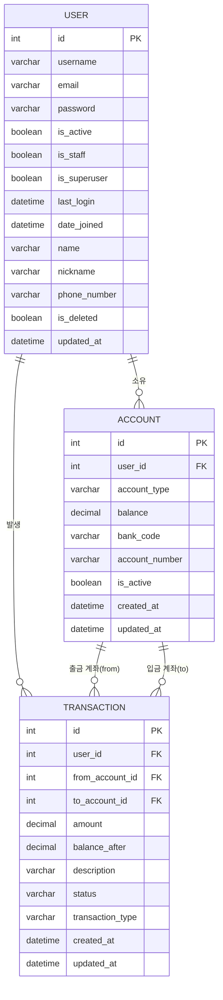

## ERD

```mermaid
erDiagram
    USER {
        int id PK
        varchar username
        varchar email
        varchar password
        boolean is_active
        boolean is_staff
        boolean is_superuser
        datetime last_login
        datetime date_joined
        varchar name
        varchar nickname
        varchar phone_number
        boolean is_deleted
        datetime updated_at
    }

    ACCOUNT {
        int id PK
        int user_id FK
        varchar account_type
        decimal balance
        varchar bank_code
        varchar account_number
        boolean is_active
        datetime created_at
        datetime updated_at
    }

    TRANSACTION {
        int id PK
        int user_id FK
        int from_account_id FK
        int to_account_id FK
        decimal amount
        decimal balance_after
        varchar description
        varchar status
        varchar transaction_type
        datetime created_at
        datetime updated_at
    }

    USER ||--o{ ACCOUNT : "소유"
    USER ||--o{ TRANSACTION : "발생"
    ACCOUNT ||--o{ TRANSACTION : "출금 계좌(from)"
    ACCOUNT ||--o{ TRANSACTION : "입금 계좌(to)"
```
