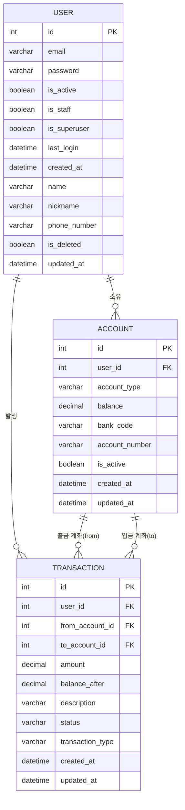
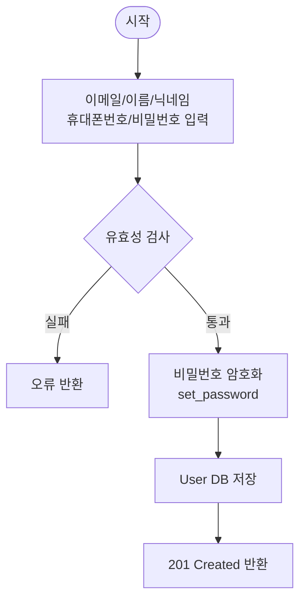
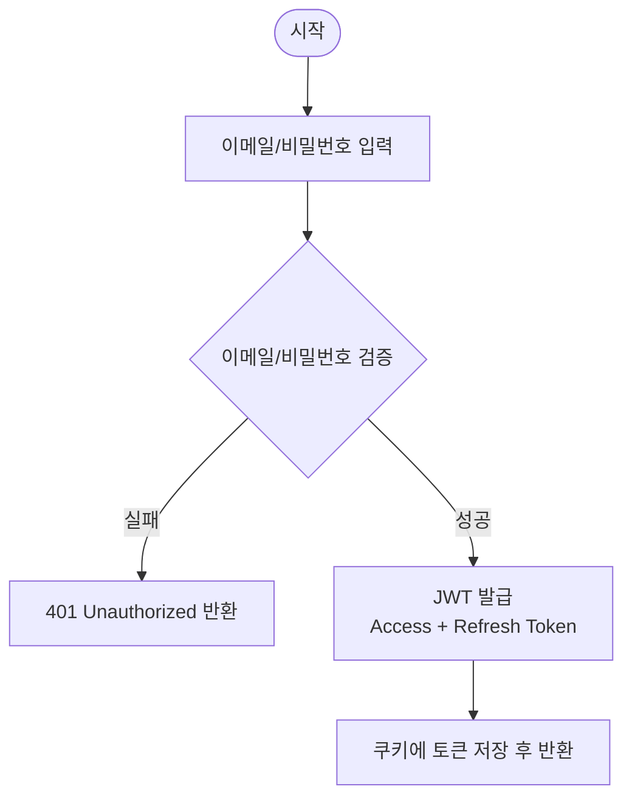
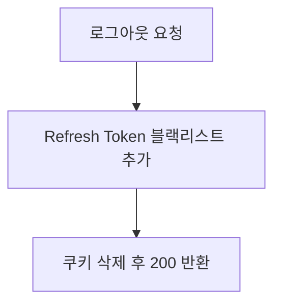

## 개발 환경 세팅

### 사전 준비
- [Docker Desktop](https://www.docker.com/products/docker-desktop/) 설치
- [uv](https://docs.astral.sh/uv/) 설치
  ```bash
  curl -LsSf https://astral.sh/uv/install.sh | sh
  ```

### 1. 저장소 클론
```bash
git clone https://github.com/oz-union-be-17-team2/Household-Accounting-System.git
cd Household-Accounting-System
```

### 2. 환경변수 설정
```bash
cp .env.example .env
```
`.env.example`의 값을 그대로 사용하면 됩니다.

### 3. 의존성 설치 및 pre-commit 세팅
```bash
uv sync --dev
pre-commit install
```

---

## 실행 방법

### 방법 1 : DB만 Docker로 실행 (개발 시 권장)

코드 수정이 즉시 반영되어 개발할 때 편리합니다.

```bash
# DB 실행
docker compose -f docker-compose.dev.yml up db -d

# 마이그레이션 및 서버 실행
uv run python manage.py migrate
uv run python manage.py runserver
```

종료
```bash
docker compose -f docker-compose.dev.yml down
```

---

### 방법 2 : 전체 Docker로 실행 (배포 환경 테스트 시)

DB와 Django 서버 모두 컨테이너로 실행합니다.

```bash
docker compose -f docker-compose.dev.yml up --build
```

종료
```bash
docker compose -f docker-compose.dev.yml down
```

---

## ERD



## 사용자 인증 플로우차트

### 회원가입


### 로그인


### 로그아웃

